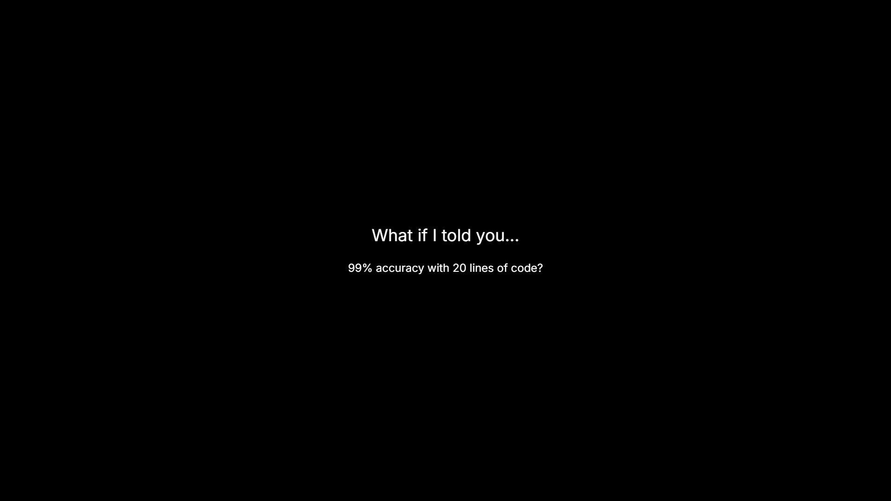

# Core_AI_Projects

**A curated collection of classic AI/ML implementations — from foundational CNNs to modern transfer learning — all in clear, runnable Jupyter notebooks.**

---

## 🎥 Project Highlight (Brag Video)

[](brag-output/composition/brag-output/brag.mp4)
<video src="brag-output/composition/brag-output/brag.mp4" poster="brag-output/composition/brag-output/brag.jpg" controls="controls" style="max-width: 100%;">
</video>


*From digit recognition to transfer learning: watch core ML techniques achieve 99% accuracy in seconds.*

---

## 📚 What’s Inside

| Notebook | Description |
|----------|-------------|
| `digit_recognition_lenet.ipynb` | Implements **LeNet‑5** on MNIST, achieving **~99%** accuracy with just a few dozen lines of PyTorch. Shows convolution, pooling, training loops, and evaluation. |
| `Transfer_learning/transferlearning.ipynb` | Demonstrates **transfer learning** using pretrained models (ResNet‑18, VGG, etc.) on the Hymenoptera (bees vs. ants) dataset. Covers feature extraction, fine‑tuning, and performance comparison. |
| `Lenna.png` | Classic test image used in the first notebook for image‑processing basics (convolution, edge detection, etc.). |
| `utils.py` | Helper functions for data loading, model training, plotting, and GPU detection (reused across notebooks). |

---

## 🛠️ How to Run

1. **Clone the repo**

   ```bash
   git clone https://github.com/yourusername/Core_AI_Projects.git
   cd Core_AI_Projects
   ```

2. **Set up the environment** (recommended: use a virtual environment or conda)

   ```bash
   # Using pip
   python -m venv venv
   source venv/bin/activate   # Windows: venv\Scripts\activate
   pip install -r requirements.txt
   ```

   The `requirements.txt` includes:
   - torch
   - torchvision
   - numpy
   - matplotlib
   - scikit‑learn
   - kagglehub (for downloading the Hymenoptera dataset)
   - torchnet
   - pandas
   - opencv‑python
   - etc.

3. **Open a notebook** with Jupyter Lab or Notebook

   ```bash
   jupyter lab
   ```

   Then run the cells sequentially to see the code in action, modify hyperparameters, and experiment.

---

## 📈 Key Results

- **LeNet on MNIST**: Test accuracy **≥ 99 %** after 10 epochs (see training logs in the notebook).
- **Transfer Learning (ResNet‑18)**: Fine‑tuning reaches **> 90 %** accuracy on the bee/ant classification task in a fraction of the time required to train from scratch.
- **Visual outputs**: The notebooks generate plots of loss/accuracy, display filtered images (edge detection, sharpening), and show classification confidence scores.

---

## 🧩 Why This Repo?

- **Educational**: Each notebook is heavily commented and walks through the intuition behind each line.
- **Reproducible**: All dependencies are listed; the code runs on CPU (CUDA detection included) and can be run on a laptop.
- **Extensible**: Swap datasets, try different architectures, or add your own experiments — the scaffolding is already there.
- **Showcase‑ready**: The included brag video (`brag-output/brag.mp4`) is perfect for READMEs, portfolio sites, Twitter/X, LinkedIn, or presentation slides.

---

## 📜 License

This project is licensed under the MIT License – see the [`LICENSE`](LICENSE) file for details.

---

## 🙏 Acknowledgments

- The LeNet implementation follows the classic architecture from Yann LeCun et al., 1998.
- The transfer learning notebook leverages PyTorch’s `torchvision.models` and the Hymenoptera dataset from Kaggle.
- Special thanks to the open‑source community for the libraries that make these demos possible.

---

*Happy hacking!*  
— *sush*
